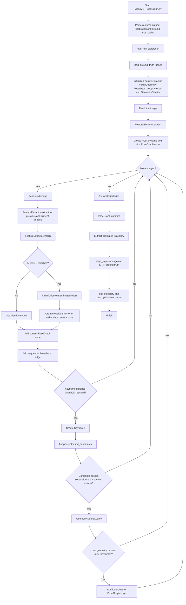

# Monocular Visual SLAM

A Python implementation of monocular visual odometry with keyframes, loop-closure detection, and pose-graph optimization. The current runner is designed for KITTI odometry data and uses KITTI camera calibration and ground-truth poses for trajectory comparison.

## Features

- ORB keypoint and descriptor extraction
- Hamming-distance descriptor matching with a ratio test
- Monocular motion estimation from the essential matrix
- Keyframe creation based on camera translation
- Loop-candidate retrieval from keyframe descriptors
- Geometric loop verification with essential-matrix RANSAC
- Pose-graph construction with sequential and loop-closure edges
- Numerical pose-graph optimization on SE(3)
- Similarity alignment against KITTI ground truth
- Trajectory and optimization-error plots

## Project Structure

`MonoVO_PoseGraph.py` is the supported application entry point.

```text
SLAM/
├── README.md
├── requirements.txt              # Python dependencies
├── .gitignore                    # Local data, caches, and generated files
├── MonoVO_PoseGraph.py           # Main executable pipeline
├── feature_extractor.py          # ORB extraction and descriptor matching
├── visual_odometry.py            # Essential matrix and relative motion
├── keyframe.py                   # Keyframe data container
├── loop_detector.py              # Loop-candidate retrieval
├── geometric_verifier.py         # Geometric loop validation
├── pose_graph.py                 # Nodes, edges, and optimization
├── utils.py                      # SE(3), KITTI, alignment, and plotting helpers
├── data/                         # Local datasets; do not commit the dataset
│   └── kitti/
│       ├── sequences/09/image_0/
│       ├── sequences/09/calib.txt
│       └── poses/09.txt
└── results/                      # Generated plots and experiment outputs
```

## Installation

Use Python 3.10 or newer.

```powershell
python -m venv .venv
.venv\Scripts\Activate.ps1
python -m pip install -r requirements.txt
```

Example `requirements.txt`:

```text
numpy
opencv-python
matplotlib
```

## Dataset Layout

This project expects the KITTI odometry data to be available locally. Do not commit the dataset to GitHub.

```text
data/kitti/
├── sequences/
│   └── 09/
│       ├── image_0/
│       │   ├── 000000.png
│       │   ├── 000001.png
│       │   └── ...
│       └── calib.txt
└── poses/
    └── 09.txt
```

The calibration file must contain a KITTI camera projection line such as `P0:`. The ground-truth file must contain 12 values per pose row: a flattened 3x4 camera pose matrix.

## Running the Pipeline

All dataset paths are required command-line arguments. The calibration matrix is loaded from the calibration file at runtime.

```powershell
python MonoVO_PoseGraph.py `
  --dataset-path "data\kitti\sequences\09\image_0" `
  --calibration-path "data\kitti\sequences\09\calib.txt" `
  --ground-truth-path "data\kitti\poses\09.txt" `
  --num-images 200 `
  --iterations 10
```

To process every image in the selected directory, use `--num-images 0`.

```powershell
python MonoVO_PoseGraph.py `
  --dataset-path "data\kitti\sequences\09\image_0" `
  --calibration-path "data\kitti\sequences\09\calib.txt" `
  --ground-truth-path "data\kitti\poses\09.txt" `
  --num-images 0
```

### Command-line arguments

| Argument | Required | Description |
|---|---:|---|
| `--dataset-path` | Yes | Directory containing numbered grayscale PNG frames. |
| `--calibration-path` | Yes | KITTI calibration file containing `P0`. |
| `--ground-truth-path` | Yes | KITTI ground-truth pose file. |
| `--num-images` | No | Number of frames to process. Default: `200`; `0` means all frames. |
| `--iterations` | No | Pose-graph optimization iterations. Default: `10`. |

## Processing Flow



## Function Call Order

1. `main()` parses the dataset, calibration, and ground-truth paths.
2. `load_kitti_calibration()` loads the camera intrinsic matrix `K`.
3. `load_ground_truth_poses()` loads KITTI poses for the selected frame count.
4. `FeatureExtractor.extract()` processes the first frame.
5. `PoseGraph.addNode()` stores the initial pose.
6. For each subsequent image:
   - `FeatureExtractor.extract()` detects ORB features.
   - `FeatureExtractor.match()` finds corresponding image points.
   - `VisualOdometry.estimateMotion()` estimates relative rotation and translation.
   - `PoseGraph.addNode()` stores the current pose.
   - `PoseGraph.addEdge()` adds the sequential motion constraint.
7. When the keyframe distance threshold is reached:
   - `LoopDetector.find_candidates()` retrieves possible old keyframes.
   - `GeometricVerifier.verify()` validates a candidate geometrically.
   - `PoseGraph.addEdge()` adds a verified loop-closure constraint.
8. `PoseGraph.optimize()` minimizes pose-graph residuals using numerical Jacobians and SE(3) updates.
9. `extract_trajectory()` retrieves poses before and after optimization.
10. `align_trajectory()` aligns the monocular trajectory with ground truth using a 3D similarity transform.
11. `plot_trajectory()` and `plot_optimization_error()` display the results.

## Outputs

The program prints:

- Number of images processed
- Visual-odometry match counts
- Current estimated camera position
- Keyframe creation events
- Verified loop closures and inlier statistics
- Pose-graph node and edge counts
- Optimization error and convergence information

It also displays:

- Estimated trajectory before optimization
- Estimated trajectory after optimization
- KITTI ground-truth trajectory
- Pose-graph optimization error by iteration

## Important Limitations

- Monocular visual odometry does not directly recover metric scale.
- Translation scale for loop closures is estimated from the current trajectory.
- The system depends on sufficient texture and feature overlap between frames.
- The current implementation is configured and tested around KITTI sequence 09.
- The loop-detector and optimizer are lightweight research implementations rather than production-grade modules.

## GitHub Hygiene

Do not commit datasets, virtual environments, Python caches, generated plots, or local IDE state. A suitable `.gitignore` should include:

```gitignore
.venv/
venv/
__pycache__/
*.py[cod]
.vscode/
data/
results/
```

If you want to keep empty `data/` and `results/` directories in Git, add `.gitkeep` files and ignore their contents instead of ignoring the directories themselves.

## License

Add a license before publishing, such as MIT, Apache-2.0, or GPL-3.0, depending on how you want others to use the project.
